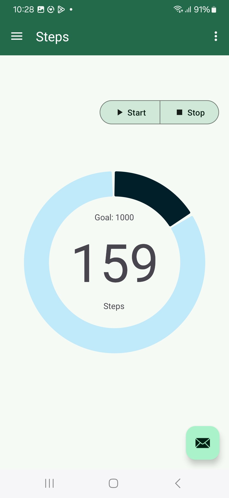

# StepAppV4

**Name**: Xiaorui Wang

**repo**: https://github.com/XiaoruiWang-SH/StepAppV4

### Exercise 1– Android Basics
#### 1. What does the “android:minSdkVersion” in android project indicate?

The android:minSdkVersion attribute in the Android project's AndroidManifest.xml file specifies the minimum version of the Android operating system (API level) that your app supports. It indicates the oldest Android version on which your app can run.

#### 2. Why Android documentation indicates that declaring the attribute “android:maxSdkVersion” is not recommended?
The android:maxSdkVersion attribute indicates the maximum version of the Android operating system (API level) on which your app can run. However, Android documentation recommends not declaring this attribute for several reasons:
* Future compatibility: By setting maxSdkVersion, you are explicitly limiting the future versions of Android that your app can run on. If you set this attribute, your app will not be installable on devices with newer Android versions, even if your app could run perfectly fine on them. This can unnecessarily restrict your app's potential user base.
* Unpredictability: Android is designed to be forward-compatible, meaning that apps developed for older versions of Android should generally work on newer versions. If issues arise with a new Android version, it's typically better to update the app to address those issues rather than artificially limiting its availability by setting maxSdkVersion.

#### 3. What are the two types of Navigation Drawer? Explain the differences between the two types?
There are two main types of Navigation Drawers in Android:

##### 1. Standard Navigation Drawer:

Description: The Standard navigation drawer is always visible on the screen. Unlike the Modal Navigation drawer, it does not slide in and out but remains fixed on the left side of the screen. It is usually found in apps designed for larger screens like tablets or desktops.

Behavior: Since the drawer is always visible, it doesn’t require any interaction to open or close. The main content area of the app is resized and adjusted to make room for the permanent drawer.

Use case: Typically used in tablet layouts or apps with a wider screen, where there's enough space to display both the navigation options and the main content simultaneously (e.g., dashboard or admin panel apps).

##### 2. Modal Navigation Drawer:

Description: The Modal navigation drawer is a sliding panel that displays the app's primary navigation menu. Modal navigation drawers use a scrim to block interaction with the rest of an app’s content, and don’t affect the screen’s layout grid. It typically slides out from the left edge of the screen, covering part of the current activity, and contains items that help users navigate to different sections or activities of the app.

Behavior: Users can open the drawer by swiping from the left edge of the screen or by tapping the hamburger menu icon (☰) in the app bar. It can be closed by swiping it back or tapping outside the drawer.

Use case: Commonly used in apps that have multiple top-level destinations or sections, such as social media apps, email clients, etc.

### Exercise 2– Material Design
#### Change the icon of the app.
1. Selcet a image creating all type of icons in res/mipmap.
2. Modified the configuration in AndroidManifest.xml.
    

    
    
    

#### Implement the dark theme
1. Download dark and modify the names, put them in res/values/themes.xml
    

    
    

2. Change the way we set colors in format: "?attr/colorName"
    

    
    

    

    
    
    
### Exercise 3 – Step Counter
#### See screenshot and code
In StepsFragment:
    

    
    

In StepCounterListener:
    

    
    

    

    
    

    